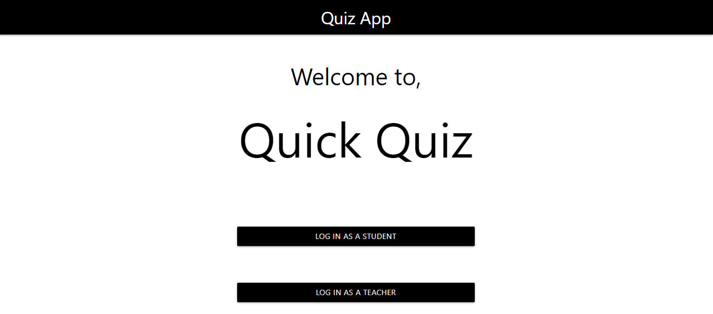

## SIMPLE WEB APP FOR EXAMS USING DJANGO FRAMEWORK

In this project a user can log in as a student or a teacher. 
As a student, one can take a test on a certain subject theat he/she chooses. Each test is timed, and if the student finishes the test before the allocated time, the test is marked automatically and the test score and incorrect questions are displayed on a new page. If the student doesn't finish on time the test closes when the time is over and the answered questions are marked. The scores of all the tests that a student takes are stored in the database.

As a teacher, one can create a new test, add a new subject or even add a new student. The teacher also sets the time for a certain test.